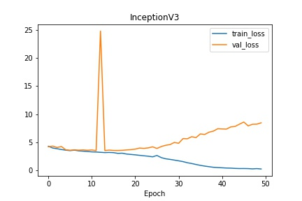
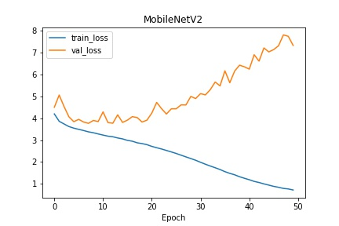
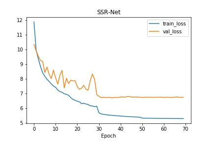
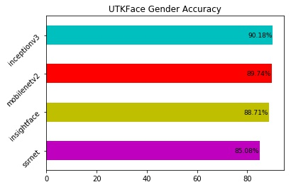
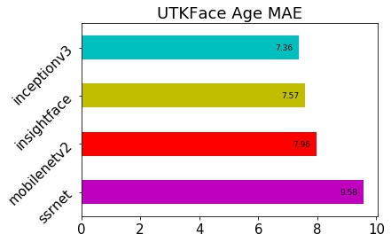
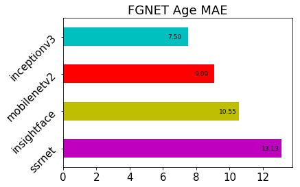
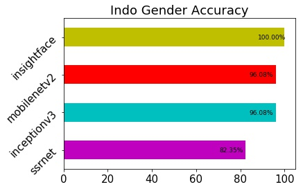
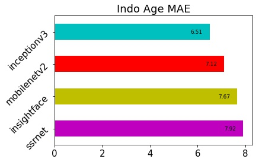
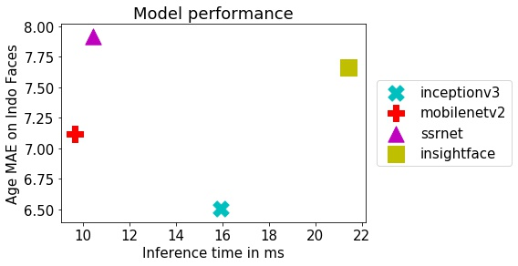

# Age and Gender Predictor
**Update from old [repo](https://github.com/dandynaufaldi/Age-Gender-Predictor)**

## Environment Setup
### Docker with GPU support
- Get [docker](https://docs.docker.com/install/) and [nvidia-docker](https://github.com/NVIDIA/nvidia-docker)
- Pull my [docker image](https://hub.docker.com/r/dandynaufaldi/tf-keras-cuda9-cudnn7/) by `docker pull dandynaufaldi/tf-keras-cuda9-cudnn7`, the Dockerfile will come in future  
### Manually
Using python 3.5, core libraries are :
- [dlib](https://github.com/davisking/dlib)
- tensorflow
- keras
- opencv
- mxnet

## Datasets
Datasets are saved in data/ directory
- [IMDB-Wiki](https://data.vision.ee.ethz.ch/cvl/rrothe/imdb-wiki/)
- [Adience](https://talhassner.github.io/home/projects/Adience/Adience-data.html)
- [UTKFace](https://susanqq.github.io/UTKFace/)
- [FGNET](http://yanweifu.github.io/FG_NET_data/index.html)
### Age Distribution


## Preprocess (for training)
For complete instruction, check on data/ directory
- For IMDB and Wiki dataset remove any unsual data from its .mat file with following characteristics:
    - Age is below 0 and above 100
    - Face score is NaN
    - Second face score is exist
    - Missing gender label
- Manual cleansing on IMDB-Wiki data with age 0-20 using [tools](https://github.com/dandynaufaldi/validation-tool)
- Detect and align face using dlib with margin 0.4 (following [1] margin size)
- Remove image which has no face detected or the face is unclear so it's not detected
- Data normalization following each model requirement (in model's prep_image method)

## Model
Here we use 3 model
### InceptionV3 and MobileNetV2
We use InceptionV3 and MobileNetV2 from keras-application without it's classifier output and modify it to have 2 output layer. 
One for gender prediction with 2 nodes and another for age prediction with 101 nodes (represent age 0-100).
We treat age prediction as multiclass classification problem with it's output calculated from softmax regression as in [1] reference
### SSR-Net
We follow default SSR-Net architecture with some modification. At the top we have 1 classifier block which then feed into 2 classifier block. In SSR-Net, we treat prediction as regression problem for both age and gender 

## Train
For InceptionV3 and MobileNetV2 we used pretrained weight from keras-application which was trained on ImageNet dataset. So, we do transfer learning on InceptionV3 and MobileNetV2. And, training from scratch on SSR-Net
Training was done in AWS P3 instance with Nvidia Tesla V100 with 10 fold cross-validation and 50 epoch each to check for model consistency and get weight file with best metrics
For each model, following input size is used:
- InceptionV3 : 140 x 140 px
- MobileNetV2 : 96 x 96 px
- SSR-Net : 64 x 64 px
Here is the training history
### InceptionV3

### MobileNetV2

### SSR-Net

## Evaluation
For model performance evaluation, we use UTKFace and FGNET dataset. Here we also try age and gender model from InsightFace project which was build on ResNet50 architecture.
We also crawl some Indonesian artist faces from wikipedia with total of 51 validated images
Here is the result (model in top position hold the best score)
### UTKFace Dataset


### FGNET Dataset

### Indonesian Face


### Inference time - performance score


## Demo Video Stream
Use `stream.py` to try the models. SORT tracker is integrated to add age and gender prediction smoothing for prediction result
Usage :
```bash
usage: video.py [-h] [-s SRC]

optional arguments:
  -h, --help         show this help message and exit
  -s SRC, --src SRC  Video stream source, default will be webcam (0)
```

## References and Acknowledgments
This project is part of my internship program at [Nodeflux](https://nodeflux.io/) as data scientist from July - August, 2018
1. [Rothe R, Timofte R, Van Gool L. Dex: Deep expectation of apparent age from a single image[C]//Proceedings of the IEEE International Conference on Computer Vision Workshops. 2015: 10-15.](https://www.vision.ee.ethz.ch/en/publications/papers/proceedings/eth_biwi_01229.pdf)
2. [Rothe R, Timofte R, Van Gool L. Deep expectation of real and apparent age from a single image without facial landmarks[J]. International Journal of Computer Vision, 2016: 1-14.](https://www.vision.ee.ethz.ch/en/publications/papers/articles/eth_biwi_01299.pdf)
3. [[IJCAI18] SSR-Net: A Compact Soft Stagewise Regression Network for Age Estimation](https://github.com/shamangary/SSR-Net)
4. [yu4u/age-gender-estimation Keras implementation of a CNN network for age and gender estimation](https://github.com/yu4u/age-gender-estimation)
5. [deepinsight/insightface Face Recognition Project on MXNet](https://github.com/deepinsight/insightface)
6. [abewley/sort Simple, online, and realtime tracking of multiple objects in a video sequence](https://github.com/abewley/sort)